# Microservices Deployment on Kubernetes using Minikube

## Overview

This project demonstrates deploying a containerized Node.js microservices application on Kubernetes using **Minikube**. Each microservice is deployed independently with its own Deployment and ClusterIP Service. An NGINX Ingress Controller is configured to route external requests to the Gateway Service, which internally communicates with the User, Product, and Order services.

---

## Project Structure

```text
Microservices-Task/
│
├── user-service/
│   ├── app.js
│   ├── Dockerfile
│   └── package.json
│
├── product-service/
│   ├── app.js
│   ├── Dockerfile
│   └── package.json
│
├── order-service/
│   ├── app.js
│   ├── Dockerfile
│   └── package.json
│
├── gateway-service/
│   ├── app.js
│   ├── Dockerfile
│   └── package.json
│
└── manifests/
    ├── deployments/
    │   ├── user-service.yaml
    │   ├── product-service.yaml
    │   ├── order-service.yaml
    │   └── gateway-service.yaml
    │
    ├── services/
    │   ├── user-service.yaml
    │   ├── product-service.yaml
    │   ├── order-service.yaml
    │   └── gateway-service.yaml
    │
    └── ingress/
        └── ingress.yaml
```

---

# Architecture

```text
                    Browser
                       |
                Ingress Controller
                       |
                 gateway-service
                       |
        --------------------------------
        |              |              |
   user-service   product-service  order-service
```

All backend services are exposed internally using **ClusterIP**, while external traffic is routed through the Gateway Service.

---

# Prerequisites

* Docker Desktop
* Minikube
* kubectl
* Git


# Minikube Setup (Windows)

### Step 1: Download Minikube

Download the latest minikube.exe from the official Minikube releases page.

### Step 2: Create a Folder

Create a folder on the C drive.

C:\minikube

Copy the downloaded minikube.exe into this folder.

Example:

C:\
└── minikube
    └── minikube.exe

### Step 3: Add Minikube to the System PATH

Open Environment Variables.
Under System Variables, select Path.
Click Edit.
Click New.
Add the following path:
C:\minikube
Click OK to save the changes.


### Step 4: Verify Installation

Open a new Command Prompt or PowerShell window and run:

minikube version


Verify installation:

```bash
docker --version
minikube version
kubectl version --client
```

Minikube installed screenshot:

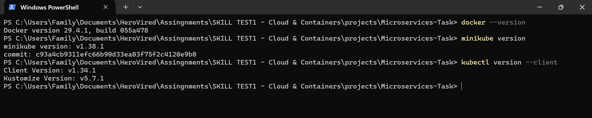


# Start Minikube

```bash
minikube start
```

Verify:

```bash
kubectl get nodes
```

Expected:

```text
NAME       STATUS   ROLES           AGE   VERSION
minikube   Ready    control-plane   xxm   v1.xx.x
```

Minikube Node screenshot:

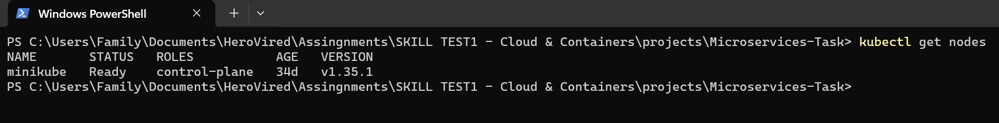

---

# Clone Repository

```bash
git clone https://github.com/ahamedkhany/Microservices-Task

cd Microservices-Task
```

---

# Build Docker Images

Since it is the project of previous assignment where we had the docker images already. Configure Docker to use the Minikube Docker daemon.

### Windows PowerShell

```powershell
& minikube -p minikube docker-env | Invoke-Expression
```

Build all images.

```bash
docker build -t user-service:latest ./Microservices/user-service

docker build -t product-service:latest ./Microservices/product-service

docker build -t order-service:latest ./Microservices/order-service

docker build -t gateway-service:latest ./Microservices/gateway-service
```

Verify images.

```bash
minikube image ls

minikube image ls | findstr service
```

Docker Images screenshot:

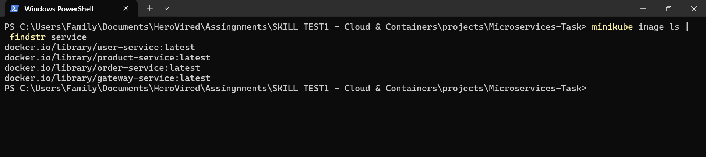


---

# Create Kubernetes Resources

Created the following deployments, services and ingress files as per the below structure in this project. 

```text
Microservices-Task/
│
├── Microservices/
│
├── manifests/
│   ├── deployments/
│   │   ├── user-service.yaml
│   │   ├── product-service.yaml
│   │   ├── order-service.yaml
│   │   └── gateway-service.yaml
│   │
│   ├── services/
│   │   ├── user-service.yaml
│   │   ├── product-service.yaml
│   │   ├── order-service.yaml
│   │   └── gateway-service.yaml
│   │
│   └── ingress/
│       └── ingress.yaml
│
├── screenshots/
│
└── README.md
```


# Deploy Kubernetes Resources

Deploy all resources.

```bash
kubectl apply -R -f manifests/
```

Or deploy individually.

Deployments

```bash
kubectl apply -f manifests/deployments/
```

Services

```bash
kubectl apply -f manifests/services/
```

Ingress

```bash
kubectl apply -f manifests/ingress/ingress.yaml
```

---

# Enable Ingress Controller

```bash
minikube addons enable ingress
```

Verify:

```bash
kubectl get pods -n ingress-nginx
```

Ingress pods screenshot:

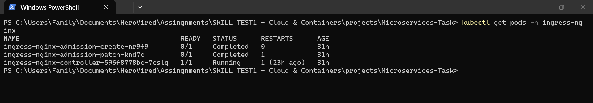


---

# Verify Resources

### Deployments

```bash
kubectl get deployments

kubectl get deployments -l 'app in (user-service,product-service,order-service,gateway-service)'
```
Deployments screenshot:

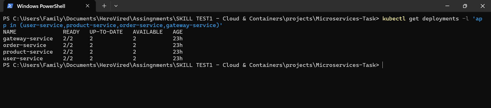


### Pods

```bash
kubectl get pods

kubectl get pods -l 'app in (user-service,product-service,order-service,gateway-service)'
```

Pods  screenshot:

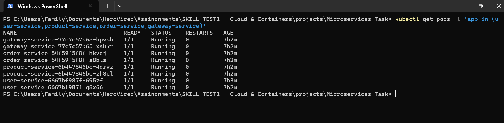


### Services

```bash
kubectl get svc

kubectl get svc | findstr "gateway-service user-service product-service order-service"
```
Services screenshot:

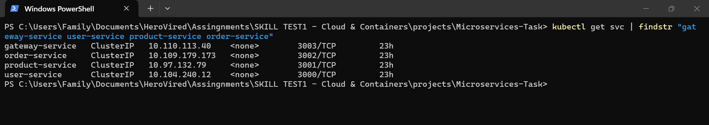


### Ingress

```bash
kubectl get ingress

kubectl get ingress | findstr "microservices-ingress"
```
Ingress screenshot:

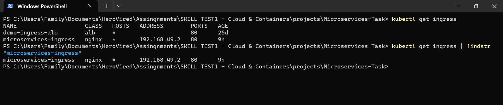


---

# Service Testing using Port Forward

Forward the Gateway Service. kubectl port-forward is a Kubernetes command that creates a temporary tunnel between your local machine and a Pod or Service inside the Kubernetes cluster.

It allows you to access an application running inside the cluster using localhost, without exposing it externally.


The format of the command is:

```text
kubectl port-forward <resource-type>/<resource-name> <local-port>:<target-port>
```

LOCAL_PORT : TARGET_PORT

This means:
Local Port (3003): Port on your computer.
Target Port (3003): Port exposed by the gateway-service inside the Kubernetes cluster.


#### the request flow is:

```text
Browser
     |
http://localhost:3003
     |
kubectl port-forward
     |
Kubernetes API Server
     |
gateway-service (ClusterIP)
     |
Gateway Pod
```


Your browser thinks it is communicating with a local application, but kubectl forwards every request into the Kubernetes cluster.

Why is it needed? Your gateway-service is of type ClusterIP.

```text
spec:
  type: ClusterIP
```

A ClusterIP Service is accessible only from within the Kubernetes cluster. Without port forwarding gateway-service cannot be accessed outside the k8s cluster.


```bash
kubectl port-forward svc/gateway-service 3003:3003
```

### Port Forward command execution screenshot:

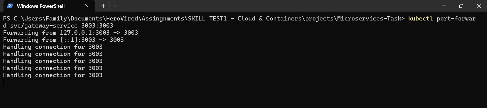

Open the following URLs in the browser.

### Gateway

```text
http://localhost:3003/
```

This doesn't gives output because there's no such endpoint present in the code, as this gateway-service with port 3003 acts only as a gateway to other services.

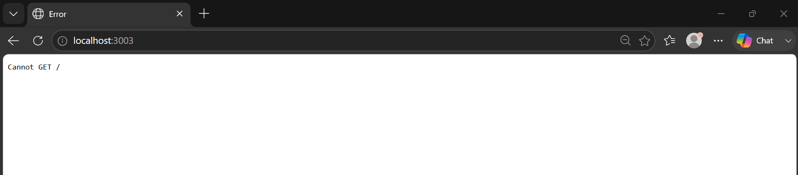


### Users

```text
http://localhost:3003/api/users
```

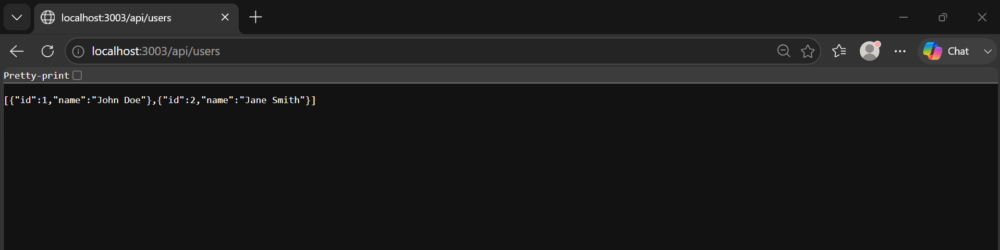


### Products

```text
http://localhost:3003/api/products
```

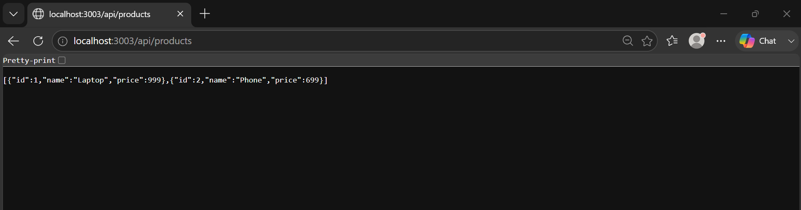


### Orders

```text
http://localhost:3003/api/orders
```

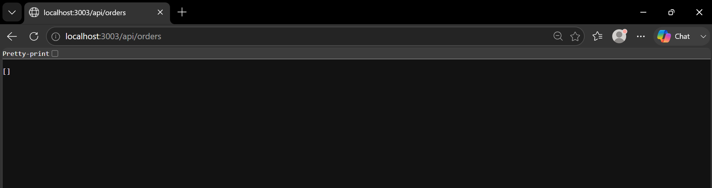


# Testing using Ingress

### Get the Ingress Controller URL.

```bash
minikube service ingress-nginx-controller -n ingress-nginx --url
```

Example output:

```text
http://127.0.0.1:65022
```

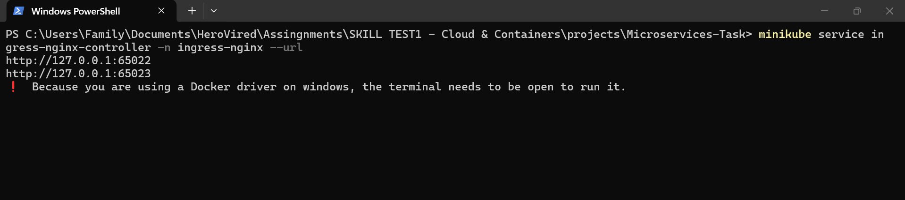


Access the application using the generated URL.

```text
http://127.0.0.1:65022/
```

### Users

```text
http://127.0.0.1:65022/api/users
```

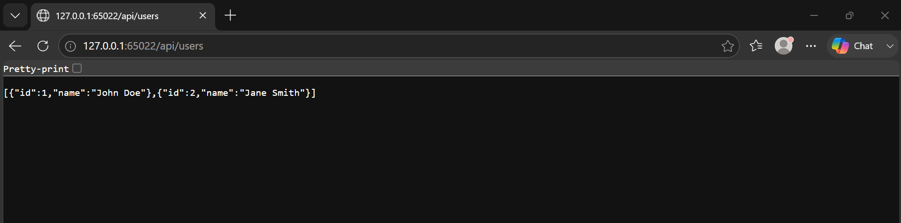


### Products

```text
http://127.0.0.1:65022/api/products
```


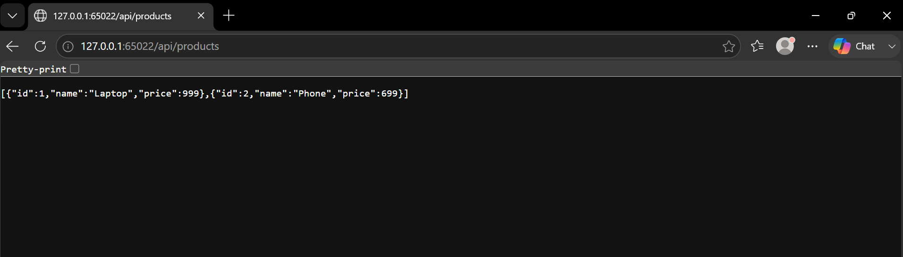


### Orders


```text
http://127.0.0.1:65022/api/orders
```


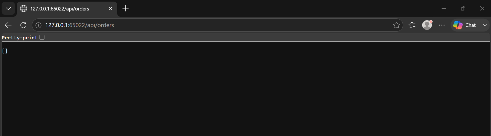


---

# View Logs showing service communication

To view logs, first we need to add the logs to console in app.js of necessary service for testing. We will be able to track the inter service communication within the cluster.
Refer the example code below.

```text
app.use(express.json());
app.use((req, res, next) => {
    console.log(`[User Service] ${req.method} ${req.originalUrl}`);
    next();
});
```

### Port forward screenshot:


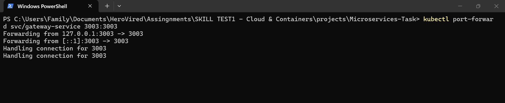


### Gateway-Service

```bash
kubectl logs deployment/gateway-service
```

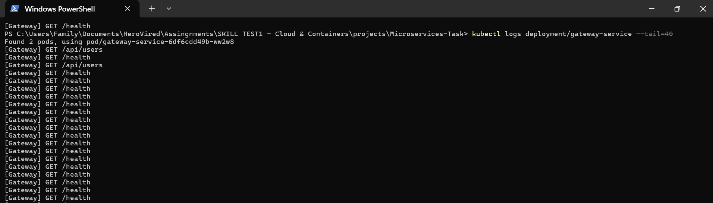


### User-Service

```bash
kubectl logs deployment/user-service
```

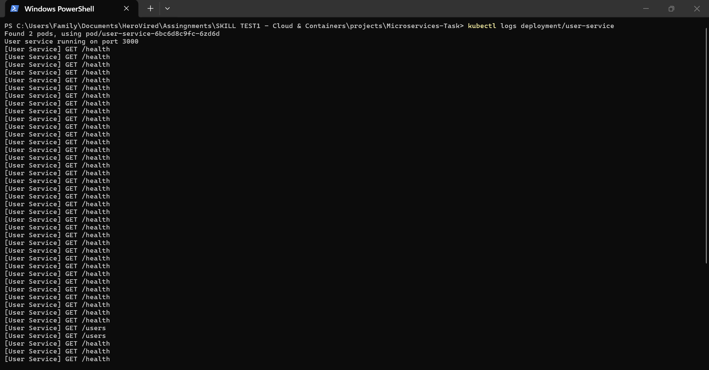


---


# Useful Kubernetes Commands

Get all resources

```bash
kubectl get all
```

Describe Deployment

```bash
kubectl describe deployment gateway-service
```

Describe Service

```bash
kubectl describe svc gateway-service
```

Delete Pods

```bash
kubectl delete pods --all
```

Restart Deployment

```bash
kubectl rollout restart deployment gateway-service

kubectl rollout restart deployment user-service

kubectl rollout restart deployment product-service

kubectl rollout restart deployment order-service
```

---

# Troubleshooting

## ImagePullBackOff

Cause

Docker images are unavailable inside Minikube.

Solution

```powershell
& minikube -p minikube docker-env | Invoke-Expression
```

Rebuild all images.

---

## Pods not Ready

Check Pod status.

```bash
kubectl get pods
```

Describe Pod.

```bash
kubectl describe pod <pod-name>
```

Check logs.

```bash
kubectl logs <pod-name>
```

---

## Ingress Not Working

Verify Ingress Controller.

```bash
kubectl get pods -n ingress-nginx
```

Get Ingress URL.

```bash
minikube service ingress-nginx-controller -n ingress-nginx --url
```

---

# Screenshots

Refer the minikube execution, test results, pods, deployments, services and ingress status captured in the screenshots folder.

---

# Technologies Used

* Docker
* Kubernetes
* Minikube
* kubectl
* NGINX Ingress Controller
* Node.js
* Express.js

---

# Author

**Ahamed Khan**
